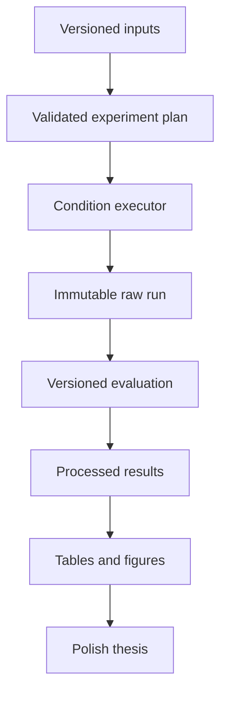

# System Overview

## Purpose

The platform will execute controlled local-LLM adaptation experiments while preserving enough evidence to reproduce, audit, and compare every valid run. It is research software for one thesis, not a general model-serving product.

## Architectural principles

- Keep scientific condition selection separate from execution mechanics.
- Represent important inputs with explicit, versioned metadata.
- Make run preparation deterministic and raw outputs append-only.
- Keep pure validation and evaluation logic testable without a model.
- Isolate external processes such as `llama.cpp` behind narrow adapters.
- Add components only when an approved experiment requires them.

## Planned components

| Component | Responsibility | Explicit boundary |
|---|---|---|
| Configuration loader | Parse and validate versioned experiment and referenced metadata | Does not execute an experiment |
| Model metadata registry | Identify model repository, revision, artifact, quantization, chat template, license, and hashes | Does not download or serve weights |
| Experiment runner | Resolve a frozen configuration, create a run, invoke a selected condition, and append observations | Does not decide research questions |
| Inference adapter | Translate a normalized request to a pinned backend and capture its raw response and timings | No method-specific prompting logic |
| Prompt resolver | Materialize approved prompt variants and hashes | No retrieval or scoring |
| Retrieval component | Build/query an approved corpus index and return traceable passages | No answer grading |
| Fine-tuning artifact registry | Describe training input, environment, adapter/export, and adaptation cost | Training pipeline remains separate from inference |
| Harness | Execute approved procedural steps and tools under explicit limits | No implicit skills or hidden prompt mutation |
| Skill resolver | Load versioned reusable procedural context for S1/C2 | No autonomous skill discovery in formal runs |
| Evaluation engine | Apply versioned deterministic metrics and recorded rubric judgments | Does not rewrite raw observations |
| Telemetry collector | Capture latency, tokens, memory, backend, environment, and failures | No production monitoring stack |
| Reporting pipeline | Transform immutable raw observations into regenerated tables, figures, and statistics | Does not manually edit raw data |

## High-level data flow

## Initial implementation boundary

The first approved change may create configuration schemas, deterministic hashing, a clean-Git provenance manifest, immutable prepared-run directories, a small CLI, focused tests, and CI. It must not implement observations or lifecycle events, model inference, retrieval, fine-tuning, harnesses, skills, benchmark content, or result interpretation.

## Failure model

Validation failures occur before a run directory is created. Once a run exists, failures are recorded as append-only events and never repaired by overwriting the historical run. A changed configuration or rerun receives a new run ID.

## Deferred decisions

- Exact inference process protocol and timeout policy
- RAG index representation and retrieval baseline
- Training artifact export format
- Harness tool protocol and safety limits
- Measurement implementation for peak RAM/VRAM
- Reporting library and figure style
